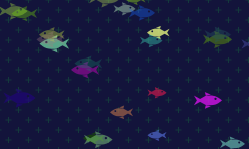

# AcuarioDeSitio
\
AcuarioDeSitio es un proyecto personal que comencé como hobby para disfrutar de la vista mientras tomaba café en mis descansos. Su objetivo es mostrar un acuario dinamico, donde el usuario puede interactuar con el con pequeñas acciones.

## Instalación 
Clone el repositorio:
```bash
git clone https://github.com/CaSaGa24/AcuarioDeSitio.github.io.git
```
### Como usar
> **Este proyecto debe ejecutarse en un servidor local**. Para hacerlo, puede utilizar [XAMPP](https://www.apachefriends.org/) para activar el servidor Apache, o bien, utilizar la extensión [Live Server](https://marketplace.visualstudio.com/items?itemName=ritwickdey.LiveServer) en [Visual Studio Code](https://code.visualstudio.com/) para visualizar el proyecto directamente desde localhost desde su navegador.
- Al iniciar, se corre el proceso `init()`, esta funcion crea 25 elementos.
- Si da clic en cualquier parte de la pantalla, hara uso de la funcion `shot()`, la cual acumula otros 25 sin exceder mas de 300.
- El `index.html` debe correr en un *servidor local* para poder funcionar.\
\
*Si desean colocar otro dibujo editen los trazos dentro de la etiqueta `<svg...` el trazo deberia verse similar a `<path d="..."` ubicado en el`index.html`*.\
*Si desean que el svg no se invierta, comenten esta línea `this.invertirSVG(directionX);`.*
### Licencia
Este proyecto está licenciado bajo la **Licencia MIT**. Para más detalles, consulta el archivo [LICENSE](LICENSE).
## Contribuciones
Las contribuciones son bienvenidas. Si tiene alguna idea o mejora, por favor abra un "Issue" o cree un "Pull Request" con su propuesta.
## Contacto
Si tiene alguna pregunta o sugerencia, no dude en contactarme a través de mi correo electrónico: **desarrollador.casaga24@gmail.com**
